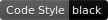
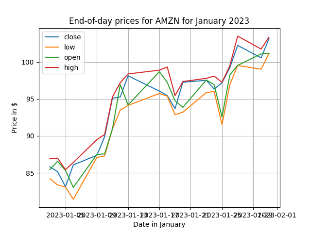

# aiomarketstack




_`aiomarketstack` is an unofficial Python-only `asyncio`-based
[Marketstack](https://marketstack.com/) client._

This library aims to be extremely observable and, therefore, comes with
`structlog` (which I adore ❤️) support out of the box. I am also currently
working on `OpenTelemetry` metrics as well.

## Installing

To get started, grab yourself a copy of `aiomarketstack`:

```bash
pip install aiomarketstack
```

## Getting Started

The easiest way to use client is via the `HttpMarketstackClient`. The following
example illustrates the most powerful utilities in `aiomarketstack`.

```python
from __future__ import annotations

import asyncio

from datetime import date
import matplotlib.pyplot as plt

from aiomarketstack import HttpMarketstackClient, MarketstackPlan
from aiomarketstack.exceptions import ResponseError
from aiomarketstack.types import Eod


async def main():
    date_range = (date(2023, 1, 1), date(2023, 1, 31))

    async with HttpMarketstackClient(
        "your-token-here",
        MarketstackPlan.FREE
    ) as client:
        try:
            eod_values: tuple[Eod, ...] = (
                await client.get_eod_range(("AMZN", ), date_range)
            )
        except ResponseError as resp_err:
            print(f"Uh-oh, a response error ocurred: {resp_err}")
            raise

    # Note that there will be missing data (if the market was closed).
    plt_xaxis = [eod["date"] for eod in eod_values]
    plt_yaxes = {
        key: [eod[key] for eod in eod_values]
        for key in {"open", "high", "low", "close"}
    }

    for label, data in plt_yaxes.items():
        plt.plot(plt_xaxis, data, label=label.capitalize())
    plt.legend()
    plt.grid()
    plt.title("End-of-day prices for AMZN for January 2023")
    plt.xlabel("Date in January")
    plt.ylabel("Price in $")
    plt.show()


asyncio.run(main())
```

Run this example to get a pretty output:



## Documentation

In progress!

### Why not [marketstack-python](https://github.com/mreiche/marketstack-python)?

The main reason this library exists is because I found the great
[marketstack-python](https://github.com/mreiche/marketstack-python) to be
unwieldy for my needs.

The three main advantages of `aiomarketstack` are:

* OpenTelemetry Metrics (Currently In Progress)
* [structlog](https://www.structlog.org/en/stable/)-style Logging.
* Much more flexible API

The main disadvantage of this library, compared with
[marketstack-python](https://github.com/mreiche/marketstack-python) is that it
does not and **will not** cache your queries. This is not and will not be the
goal of this library.

## Development

To manually build `aiomarketstack` for development, we use `poetry`. Get
started with:

```bash
git clone https://github.com/markovejnovic/aiomarketstack.git
cd aiomarketstack
poetry install && poetry build
```

### Unit Tests

You can test your code against test suite via `tox`.

```bash
MARKETSTACK_TOKEN_TEST=<Your-Marketstack-Free-Token> tox
```

> [!CAUTION]
> This will consume about 30 API requests.

## Contributing

In progress! Feel free to open a issue if you spot something!

## License

```
MIT License

Copyright (c) 2023 Marko Vejnovic <markovejnovic@plocca.com>

Permission is hereby granted, free of charge, to any person obtaining a copy
of this software and associated documentation files (the "Software"), to deal
in the Software without restriction, including without limitation the rights
to use, copy, modify, merge, publish, distribute, sublicense, and/or sell
copies of the Software, and to permit persons to whom the Software is
furnished to do so, subject to the following conditions:

The above copyright notice and this permission notice shall be included in all
copies or substantial portions of the Software.

THE SOFTWARE IS PROVIDED "AS IS", WITHOUT WARRANTY OF ANY KIND, EXPRESS OR
IMPLIED, INCLUDING BUT NOT LIMITED TO THE WARRANTIES OF MERCHANTABILITY,
FITNESS FOR A PARTICULAR PURPOSE AND NONINFRINGEMENT. IN NO EVENT SHALL THE
AUTHORS OR COPYRIGHT HOLDERS BE LIABLE FOR ANY CLAIM, DAMAGES OR OTHER
LIABILITY, WHETHER IN AN ACTION OF CONTRACT, TORT OR OTHERWISE, ARISING FROM,
OUT OF OR IN CONNECTION WITH THE SOFTWARE OR THE USE OR OTHER DEALINGS IN THE
SOFTWARE.
```
